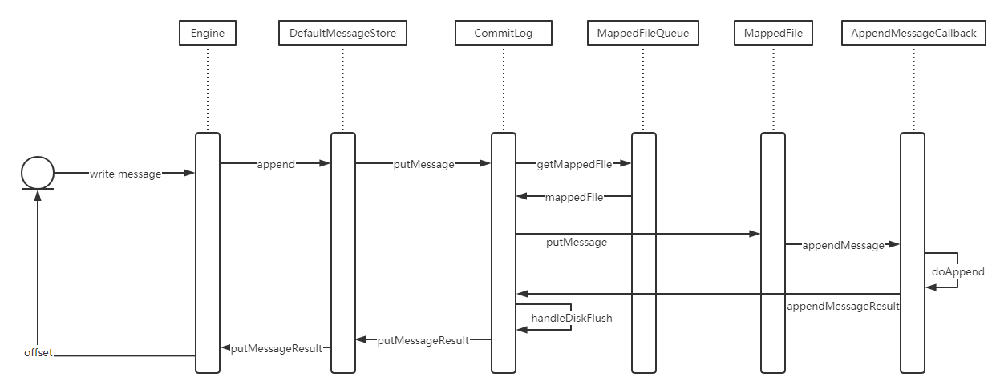

Message协议
- totalSize 消息大小 4
- magicCode 消息魔术码 4
- queueId 队列编号 4
- queueOffset consumeQueue中的逻辑偏移量 8
- physicalOffset 消息在commitLog中的物理起始地址偏移量 8
- reConsumeTimes 消息被某个订阅组重新消费了几次 4
- body 前4个字节存储消息体大小值，后bodyLength大小空间存储了消息体内容 4+bodyLength 4GB
- topic 前一个字节存放topic名称能容大小，后存放了topic的内容 1+topicLength 256B
- properties 前2个字节（short）存放属性值大小，后存放propertiesLength大小的属性数据 2+propertiesLength 64KB

- write流程时序图

- flag 不处理？
- sysFlag 消息标志，指明消息是事务状态等消息特征（半消息？）  
- bodyCRC 消息体校验码
- bornTimestamp producer的时间戳
- bornHost（ip+port）producer的地址
- storeTimestamp 存储时间戳
- storeHost  消息存储到broker的地址
- preparedTransactionOffset 表示该消息是prepared状态的事务消息